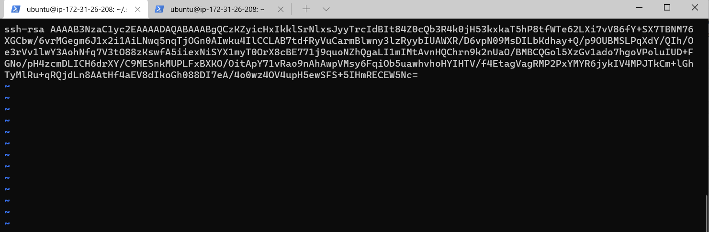

# AUX PROJECT 1
## Title: SHELL SCRIPTING
### TASK: 
This Project describes how 20 new Linux users were onboarded onto a server.

<!-- Horizontal Rule -->
------------------------------------

1. STEP ONE: Created a project folder named Shell
<!-- Code Blocks -->
```bash
$ mkdir Shell
$ cd Shell 
```
Creating Shell directory


<!-- Horizontal Rule -->
------------------------------------

2. STEP TWO: Created a csv file names.csv to store user names in Shell directory
<!-- Code Blocks -->
```bash
$ touch names.csv
$ vim names.csv
```
Creating file names.csv


<!-- Horizontal Rule -->
------------------------------------
3. STEP THREE: Created developers group
<!-- Code Blocks -->
```bash
$ groupadd developers
$ cat /etc/group | grep "developers"
```
Creating "developers" group and verifying it was successfully created


<!-- Horizontal Rule -->
------------------------------------

4. STEP FOUR: Updating current ubuntu user with public and Private keys
<!-- Code Blocks -->
```bash
$ cd .ssh
$ touch id_rsa.pub
$ touch id_rsa
$ vim id_rsa.pub
$ vim id_rsa
```
Creating id_rsa.pub and id_rsa files and adding the keys.




<!-- Horizontal Rule -->
------------------------------------

5. STEP Five: Creating Script, adding execution permission for ubuntu user to run script, and finally running script.
<!-- Code Blocks -->
```bash
$ vim onboarding_users.sh
$ chmod u+x onboarding_users.sh
$./onboarding_users.sh
```
Execution permission given to ubuntu user.


Shell Script


Script was successful. New users in /etc/passwd file.


<!-- Horizontal Rule -->
------------------------------------

Testing onboarded users connections.


